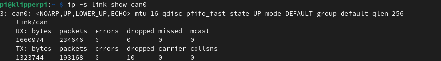

# Bigtreetech U2C

## Step 1: **PI Setup**
Open Putty or your preferred SSH tool and connect to your printers RaspberryPi using its IP address, username and password.

Then execute the following command:
`sudo nano /etc/network/interfaces.d/can0`

This will open the file editor for you can0 interface. Please copy and paste the content below, into this window.

```bash
allow-hotplug can0
iface can0 can static
 bitrate 1000000
 up ifconfig $IFACE txqueuelen 1024
 pre-up ip link set can0 type can bitrate 1000000
 pre-up ip link set can0 txqueuelen 1024
 ```

Once inserted, press <kbd>Ctrl</kbd>+<kbd>X</kbd> to save.
You can now reboot the pi with ` sudo reboot `.


## Test the network

Once the pi has rebooted, use Putty to log back in. You can run the `ip -s link show can0` command to check your network status.

You should see a line like the one below in the results.
The key thing to note is that the network is **UP** for now.



## Troubleshooting

  

1.  > I can see my `can0` network but when I connect my device to query the uuid there is no value returned.

  

[Check Wiring]()

- The USB cables can be dodgey, try another one

- Verify with `lsusb`

- Check you havent gotten CAN_H/CAN_L or V+/V- switched

[check network]()

- Ensure the "Bus Speed" is the same throughout your installation

[Check Firmware]()

- If in doubt, flash the latest Firmware to your U2C.

[Check Termination]()

- Ensure you have the relevant termination jumper(s) in place, typically this is the one nearest the USB-C port.

## Flashing U2C Firmware

**note: The boards are flashed from the factory so should not need flashing in most cases**
*The U2C does not need Canboot or Klipper flashing, only the firmware to act as a can network adapter (I mean you can, its not what its for)*

In order to flash the U2C the `boot` button needs to be held and released after connecting the USB cable to the board.

If you have the STM32F072 version of the board (U2C 1.0/1.1) You can **flash [candlelight_fw](./candlelight_fw.md)**

If you have the STM32G0B1 version, you must use the firmware provided by BTT [https://github.com/bigtreetech/U2C/tree/master/firmware](https://github.com/bigtreetech/U2C/tree/master/firmware)
 


### [Return to Main](../index.md)
